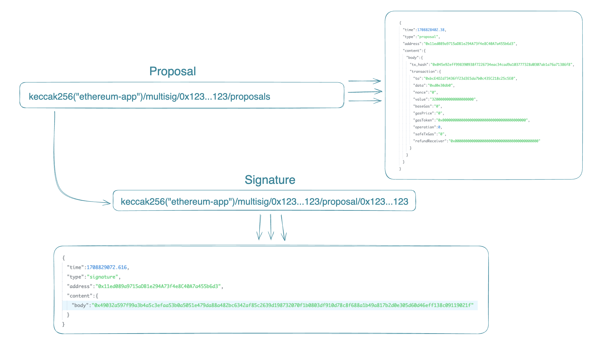

# SAFU {wallet}

## What is SAFU {wallet}

SAFU {wallet} is the first fully decentralized multisig, powered by [aleph.im](https://aleph.im/). It uses the aleph network to store signature approvals off-chain by keeping it in a decentralised storage. It uses a deterministic way to store proposals and signatures, so anyone can build their own UI to interface with SAFU {wallet}.

## Artchitechture of our protocol on top of Aleph

We are working with 3 ressources:
- multi-sig: address of the multi-sig contract on ethereum
- proposal: hash of the Tx proposed to the owners of the multi-sig
- signature: signatures mandatory to execute the proposed transactions, the minimum required depends on the treshold configured in the multi-sig contract.

and we can access different ressources by following the defined format for channels:
- proposals: `${APP_ID}/multisig/${MULTI_SIG_ADDR}/proposals`
- signatures: `${APP_ID}/multisig/${MULTI_SIG_ADDR}/proposal/${PROPOSAL_TX_HASH}`

This usage of Aleph's channels helps us to easily find the needed ressources without the need of any backend in a fully decentralized way.

## Welcome contributions
We are deeply committed to open source, valuing the collaborative spirit and innovation it fosters. We warmly welcome contributions from everyone, inviting you to join us in enhancing and expanding our project. 

> see [CONTRIBUTING.md](./CONTRIBUTING.md) :)
